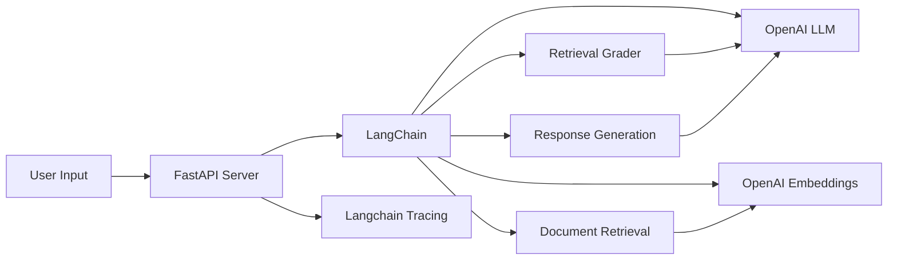

# 基于langchain的RAG智能问答系统

[](https://opensource.org/licenses/MIT)
[](https://www.python.org/downloads/)
[](https://langchain.com/)
[](https://openai.com/)
## 运行示例


### 快速运行

```bash
# 克隆项目
git clone https://github.com/mewchao/rag_chatbot.git
cd rag_chatbot
```
#### 创建虚拟环境
```python
python -m venv .venv
.\.venv\Scripts\activate   # Windows
```
#### 安装依赖
```python
pip install -r requirements.txt
```
####
```python
python gui.py
```
## 📖项目概述


基于检索增强生成技术（RAG）构建的智能问答系统，无缝结合了先进的检索与生成能力。利用 LangChain 框架，实现了高效的对话管理与知识检索功能，为用户提供准确、智能的信息响应。




## 技术亮点

#### 应用 RAG 技术，通过检索预加载文档生成准确的回答。
#### 集成 LangChain，实现对话流程管理和上下文记忆。
#### 利用嵌入模型与向量存储，优化语义搜索的高效检索能力。
## 个人贡献
#### 设计并实现了系统架构与核心功能。
#### 优化了检索与生成模块的性能，确保系统运行稳定。
## 项目价值

该项目展示了 RAG 与 LangChain 在智能对话领域的应用潜力，可广泛用于客服支持、知识查询等场景。

## 💡 应用场景

- 智能客服: 提供准确、个性化的用户支持
- 知识库查询: 快速从大型文档集中检索信息
- 教育辅助: 为学习者提供精准的知识点解答
- 企业内训: 助力员工快速获取专业领域知识

## 📈 项目价值
该系统展示了 RAG 技术与 LangChain 在智能对话领域的巨大潜力，通过将检索与生成相结合，有效解决了大语言模型的知识时效性问题，同时提高了回答的准确性和可靠性。系统设计兼顾了灵活性和可扩展性，可适应不同领域的知识问答需求。
