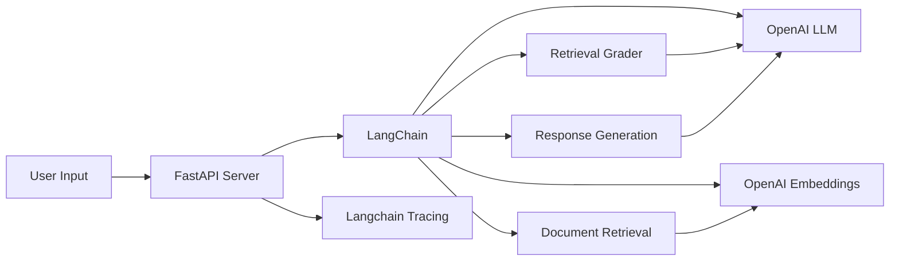

# 基于langchain的RAG智能问答系统

[](https://opensource.org/licenses/MIT)
[](https://www.python.org/downloads/)
[](https://langchain.com/)
[](https://openai.com/)
## 运行示例


### 快速运行

```bash
# 克隆项目
git clone https://github.com/mewchao/rag_chatbot.git
cd rag_chatbot
```
#### 创建虚拟环境
```python
python -m venv .venv
.\.venv\Scripts\activate   # Windows
```
#### 安装依赖
```python
pip install -r requirements.txt
```
####
```python
python gui.py
```
## 📖项目概述


基于检索增强生成技术（RAG）构建的智能问答系统，无缝结合了先进的检索与生成能力。利用 LangChain 框架，实现了高效的对话管理与知识检索功能，为用户提供准确、智能的信息响应。




---

## 技术亮点

- **RAG（检索增强生成）技术**  
  系统通过从用户提供的网页文档中检索相关信息，并结合语言模型生成回答，确保结果与输入内容高度相关。检索过程基于语义相似性，返回最匹配的文档片段。

- **动态对话流程管理**  
  通过状态图设计，支持多阶段处理：从判断是否需要检索，到调用工具获取文档，再到生成最终回答，整个流程灵活且上下文连贯。

- **高效语义检索**  
  使用嵌入模型将文档分割并转化为向量存储，支持快速、精准的语义搜索，能够从大量文本中提取与问题最相关的内容。

- **文档相关性筛选**  
  系统内置评估机制，对检索到的文档进行相关性打分，剔除无关信息，提升回答的准确性。

- **回答透明性支持**  
  在生成回答的同时，系统还能定位并展示具体的参考文档段落，包括标题、来源和原文片段，使用户能够验证回答依据。

---

## 个人贡献

- **系统架构设计与实现**  
  从网页加载、文档处理到问答流程，设计并实现了完整的系统架构，确保各模块无缝协作。

- **交互式界面开发**  
  开发了图形化界面，支持用户输入网页链接、提出问题，并展示回答和参考内容，提升了系统的易用性。

- **检索与生成优化**  
  优化了文档检索和回答生成的逻辑，确保检索结果与问题匹配，回答简洁且不超过三句话，同时保持信息准确。

- **稳定性保障**  
  在文档加载和处理过程中加入了状态提示和错误处理机制，确保系统运行稳定，用户体验流畅。

---

## 项目价值

该项目通过结合检索增强生成技术与动态对话管理，打造了一个高效的问答系统。系统能够从用户提供的网页内容中提取最新信息，弥补语言模型知识时效性的不足，同时生成简洁、准确的回答。回答过程透明，用户可以看到具体参考的文档段落，增强了结果的可信度。系统的设计灵活，支持扩展到不同数据源和问答场景，具有较高的实用价值。

---

## 💡 应用场景

- **智能客服**  
  用户输入问题，系统从公司网页或 FAQ 中检索并生成回答，提供快速、准确的客户支持。

- **知识库查询**  
  企业员工通过输入内部文档链接，快速获取所需信息，适用于技术支持或政策查询。

- **教育辅助**  
  学生上传课程相关网页，系统根据问题提供简洁解答和原文参考，助力学习。

- **研究支持**  
  研究人员输入多个网页链接，系统提取相关内容并回答问题，加速文献分析过程。

---

## 📈 项目价值

该系统展示了检索增强生成技术与对话管理的强大结合，能够高效处理用户提供的外部文档并生成可靠回答。通过语义检索和相关性筛选，系统确保了回答的精准性；通过参考段落展示，增强了透明度和用户信任。界面友好、流程动态的特点使其适用于多种实际场景，如客服、教育和研究支持，展现了智能问答领域的广阔应用潜力。

---
